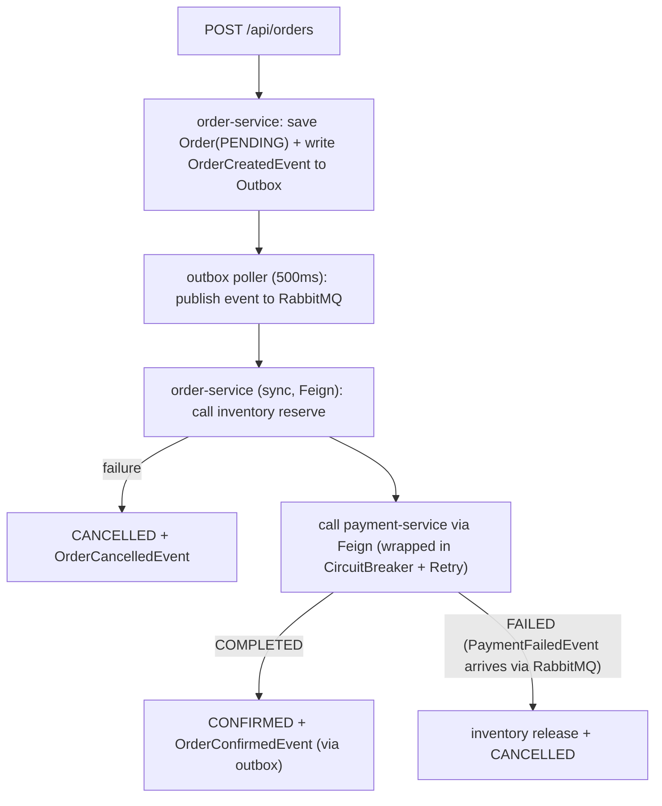
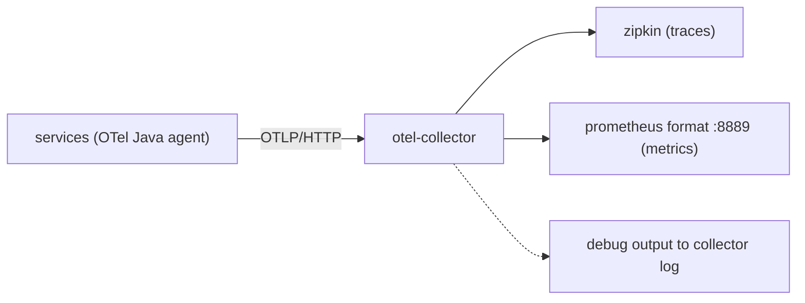

# ShopFlow — Architectural Contract (SPEC)

> **Note:** Contract document originally written for a training course; § numbers are the stable reference used by code comments (`// SPEC §4`) and course material.

This file is the **single source of truth** for the example project. Every service stays faithful to this contract; where a deliberate deviation exists (e.g. the payment stub's random failures), it is called out explicitly below.

## 1. Technology Matrix (fixed versions)

| Component | Version | Note |
|---|---|---|
| Java | 21 | Base image: `eclipse-temurin:21-jre-alpine` |
| Spring Boot | 4.1.x | Parent: `spring-boot-starter-parent:4.1.1` |
| Spring Cloud | 2025.1.3 | Eureka, Gateway, Config, OpenFeign, CircuitBreaker, Bus |
| PostgreSQL | 18-alpine | product, inventory, order, payment |
| RabbitMQ | 4-management (4.3.5) | Messaging |
| Keycloak | 26.7.3 | OAuth2 / OIDC provider |
| Kafka | 3.7 (bitnami k8s chart, theoretical) | Discussed in theory only; no code in this repo |
| Maven | wrapper (mvnw) | `maven-compiler-plugin` release=21 |

## 2. Services and Ports

| Service (artifactId) | Port | Description | Dependencies |
|---|---|---|---|
| `discovery-server` | 8761 | Eureka Server | — |
| `config-server` | 8888 | Spring Cloud Config (native profile, reads from classpath) | — |
| `api-gateway` | 8080 | Spring Cloud Gateway, Keycloak JWT resource server | discovery, keycloak |
| `product-service` | 8081 | Product catalog (CRUD) | postgres |
| `inventory-service` | 8082 | Stock query/reservation | postgres |
| `order-service` | 8083 | Orders + saga orchestrator + outbox | postgres, rabbitmq, Feign→inventory/payment |
| `payment-service` | 8084 | Payment (stub: ~20% random failure → resiliency demo) | postgres, rabbitmq |
| `notification-service` | 8085 | RabbitMQ consumer, logs events, H2 in-memory | rabbitmq |
| `common-events` | — | Shared event records (library module) | — |

## 3. REST Contract

All services serve REST without a context-path, under the `/api/...` prefix. Gateway routes match `Path=/api/<service>/**` and use `StripPrefix=0`.

### product-service
```
GET    /api/products                → List<ProductResponse>
GET    /api/products/{id}           → ProductResponse (404 → ProblemDetail)
GET    /api/products/{sku}/stock    → {sku, available, quantity} (Day 3 Feign chain: product → inventory; FeignException → 500 ProblemDetail)
POST   /api/products                → 201 ProductResponse  {sku, name, price, description}
```
ProductResponse: `{id: Long, sku, name, price: BigDecimal, description}`

### inventory-service
```
GET    /api/inventory/{sku}                      → {sku, available: boolean, quantity: int}
GET    /api/inventory/flags                      → {"freeShipping": boolean} (Day 3 @RefreshScope config demo)
POST   /api/inventory/{sku}/reserve              → 200 {sku, reservedQuantity: int}  {quantity: int}
POST   /api/inventory/{sku}/release              → 200 {sku, releasedQuantity: int}  {quantity: int}
```
Insufficient stock → 409 ProblemDetail `{detail: "Insufficient stock for SKU: X"}`

### order-service
```
POST   /api/orders            → 202 {orderId: UUID, status}  {customerId: UUID, items: [{sku, quantity}]}
GET    /api/orders/{id}       → {orderId, customerId, status, items[], totalAmount, createdAt}
GET    /api/orders            → List (CQRS read model — query view for the list endpoint)
POST   /api/orders/{id}/cancel → 200 (saga compensation demo)
```
Order statuses: `PENDING → INVENTORY_RESERVED → CONFIRMED | CANCELLED`

### payment-service
```
POST   /api/payments          → 200 {paymentId: UUID, orderId: UUID, status: COMPLETED|FAILED}  {orderId: UUID, amount: BigDecimal}
```
Stub: returns FAILED with ~20% probability (random), to trigger saga compensation.

## 4. RabbitMQ Contract

Exchange: `shopflow.events` (topic, durable). Routing keys:

| Routing key | Publisher | Consumer | Payload (record in common-events) |
|---|---|---|---|
| `order.created` | order-service | notification-service | `OrderCreatedEvent(orderId, customerId, totalAmount, items)` |
| `order.confirmed` | order-service | notification-service | `OrderConfirmedEvent(orderId, customerId, totalAmount)` |
| `order.cancelled` | order-service | notification-service | `OrderCancelledEvent(orderId, customerId, reason)` |
| `payment.failed` | payment-service | order-service | `PaymentFailedEvent(orderId, reason)` |

Queues: `notification.order.queue` (binding: `order.*`), `order.payment.queue` (binding: `payment.failed`).
JSON serialization via Jackson; consumers use `@RabbitListener`.

## 5. Saga (Orchestration) Flow — order-service



Note: Deliberate hybrid design — the same flow demonstrates both synchronous Feign calls and asynchronous events. This is an intentional choice and is stated here explicitly.

## 6. Outbox

Inside `order-service` there is an `outbox` table (`id UUID, aggregate_id, type, payload jsonb, status NEW/SENT, created_at`).
A `@Scheduled(fixedDelay=500)` poller publishes `NEW` rows and marks them `SENT`. Kept simple on purpose; it is the live answer to the question "why is a transactional outbox needed?".

## 7. Security

- Keycloak realm: `shopflow` · client: `shopflow-gateway` (public, PKCE) · client credentials client: `shopflow-backend` (confidential, for the service-to-service demo)
- Roles: `customer`, `admin`
- Gateway: JWT validation against Keycloak JWKS (issuer-uri configuration)
- product-service: `spring-boot-starter-security-oauth2-resource-server`; product write operations require `hasRole("admin")`
- **Deliberate deviation:** inventory and order do NOT enforce JWT. The saga's Feign calls (order → inventory, order → payment) carry no token; adding a resource server there would 401 the saga. JWT enforcement is demonstrated on the gateway + product-service pair, which is enough for the Day 5 demo. The gateway forwards the `Authorization` header; inventory/order simply ignore it.
- Test users: `alice/customer123` (customer), `bob/admin123` (admin) — realm import file: [docker/keycloak/shopflow-realm.json](docker/keycloak/shopflow-realm.json)

## 8. Configuration

- `config-server`: `native` profile, `classpath:/configs/{application}` — native instead of git (offline and fast; in real life a git backend is the recommended choice).
- Shared config file: `application.yml` (applied to all services) + per-service files.
- `configs/inventory-service.yml` carries `shopflow.feature.free-shipping` — flipped live for the Day 3 refresh / Day 3 optional Cloud Bus demos (`GET /api/inventory/flags` shows the change without a restart).
- `registry-fetch-interval-seconds: 5` on all Eureka clients (shared config) — classroom speed knob; keep the 30 s default in production.
- `spring-cloud-starter-bus-amqp` on config-server; `/actuator/busrefresh` demo (optional, can be skipped).

## 9. Docker & Kubernetes

- A `Dockerfile` per service (multi-stage: maven build → temurin jre runtime).
- `docker-compose.yml`: postgres, rabbitmq, keycloak + 8 services. One command: `docker compose up -d --build`.
- `k8s/`: Deployment + Service per service; basic manifests for Keycloak/Postgres/RabbitMQ as well. The config-server's `classpath:/configs` files are **baked into the image** at build time — no extra ConfigMap is needed (native profile reads from the classpath). Minikube `addons enable ingress` is not required (Gateway is exposed via NodePort).
- JWT in k8s: tokens are fetched via `kubectl port-forward svc/keycloak 8180:8080`; the gateway/product deployments pin `issuer-uri=http://localhost:8180/...` + internal `jwk-set-uri` env overrides (see `k8s/07` and `k8s/08`).

## 10. Code Standards

- Package root: `com.shopflow.<service>` (e.g. `com.shopflow.product`), shared events in `com.shopflow.common.events`.
- Layers: `api` (controller/DTO), `domain` (aggregate/value object/repository interface), `app` (service), `infra` (repo/config/mq).
- **Tactical DDD:** domain packages are plain Java — no Spring or JPA imports. Aggregates carry their rules (no setters; behavior methods only, e.g. `Order.confirm()`, `StockItem.reserve()`); VOs are records (`Money`, `OrderId`, `OrderItem`). Repositories are interfaces in `domain`, implemented by `infra` as JPA entities + `*Jpa` + `*Mapper` + `@Repository` adapter. `app` holds no business rules — orchestration only.
- **No Lombok** (no extra IDE dependency); records + classic getters are used.
- All code in English; short in-class English comments (`// Day 4: this is the outbox poller...`) are welcome.
- Error responses: Spring `ProblemDetail` (RFC 7807).
- Tests: minimal — one `@SpringBootTest` context-load test per business service (compile/run verification) plus pure domain unit tests (aggregate rules, VOs).

## 11. Observability — OTel Pipeline

ShopFlow ships a **full embodiment** of the OpenTelemetry architecture:



### 11.1 Versions

| Component | Version | Note |
|---|---|---|
| OTel Java agent | 2.31.1 | `docker/otel/opentelemetry-javaagent.jar` (no code changes needed) |
| OTel Collector | 0.160.0 | `docker/otel/otel-collector-config.yaml` (otlp → batch → zipkin + debug) |
| Zipkin | 3 | `openzipkin/zipkin:3` — UI: http://localhost:9411 |

### 11.2 Which services carry the agent?

- **With agent:** `api-gateway`, `product-service`, `inventory-service`, `order-service`, `payment-service`, `notification-service` (JAVA_TOOL_OPTIONS + otel env vars in docker-compose.yml).
- **Without agent:** `discovery-server`, `config-server` — platform services; excluded from tracing to reduce noise (explained via comments in the compose file).
- Metrics exporter `otlp` (the collector serves them in Prometheus format on :8889 — see [§11.6](#116-metrics-pipeline-otlp--collector--prometheus-format)); logs exporter `none` (the log-collecting signal is the optional ELK profile — see [§11.7](#117-elk-profile-optional-log-stack---profile-elk)); propagator: `tracecontext,baggage`.
- Business services' log output is profile-dependent via `logback-spring.xml`: JSON under the `docker,elk` Spring profiles (`LogstashEncoder`), Boot's readable console output otherwise.

### 11.3 Local run (without compose)

You can run only Zipkin and start the agent against it instead of the full Zipkin + collector stack:

```bash
docker run -d --name shopflow-zipkin -p 9411:9411 openzipkin/zipkin:3
java -javaagent:docker/otel/opentelemetry-javaagent.jar \
  -Dotel.service.name=order-service \
  -Dotel.exporter.otlp.endpoint=http://localhost:9411/api/v2/spans \
  -Dotel.exporter.otlp.protocol=http/protobuf \
  -jar target/order-service-1.0.0.jar
# or the ready-made script: ./scripts/run-with-otel.sh order-service
```

> The script points the agent directly at Zipkin for a bare-bones demo; in compose, the collector sits in between (the typical production topology).

### 11.4 Verification

1. `docker compose up -d --build` (zipkin + otel-collector come up too).
2. Place an order ([§3](#3-rest-contract) order-service; see the curl example in [README](README.md)).
3. http://localhost:9411 → "Run Query" → open the `POST /api/orders` trace; you should see the api-gateway → order-service → inventory/payment span tree and the RabbitMQ consumer span.
4. The collector log shows the spans being emitted: `docker compose logs otel-collector` (debug exporter).

### 11.5 Kubernetes note

The `k8s/` manifests **do not cover** OTel; collector/zipkin Deployments are left as an exercise for the reader.

### 11.6 Metrics pipeline (OTLP → Collector → Prometheus format)

Besides traces, the metrics signal is also enabled:

- Business services set `OTEL_METRICS_EXPORTER: "otlp"` (docker-compose.yml) — the agent sends JVM + HTTP metrics to the collector over OTLP.
- The collector has a separate `metrics` pipeline in `docker/otel/otel-collector-config.yaml`: `receivers: [otlp] → processors: [batch] → exporters: [prometheus, debug]`.
- The `prometheus` exporter puts metrics in **Prometheus exposition format** on `0.0.0.0:8889`; compose publishes this port.
- Verification: `curl -s localhost:8889/metrics | grep -i http | head` — you should see the `http_server_*` metrics.
- In production a Prometheus server scrapes this endpoint; a single `curl` demo is enough here.

### 11.7 ELK profile (optional log stack — `--profile elk`)

An optional log collection stack is added to compose; it does **not** start with a plain `docker compose up`:

```bash
docker compose --profile elk up -d --build
```

| Service | Role |
|---|---|
| `elasticsearch` (9.4.6) | Log store (single-node, security off, heap 512m) |
| `logstash` (9.4.6) | Receives JSON logs on UDP :5000, writes to the `shopflow-logs-*` index |
| `kibana` (9.4.6) | UI: http://localhost:5601 (index pattern in Discover: `shopflow-logs-*`) |
| `logspout` (v3.2.14) | Streams all container stdout to logstash over UDP via the Docker socket |

- Infrastructure containers (zipkin, otel-collector, elasticsearch, logstash, kibana) get `LOGSPOUT=ignore` so they do not write their own noise into Elasticsearch. ALL logs of the business services and platform services (discovery/config) are collected.
- Business services run with `SPRING_PROFILES_ACTIVE: docker,elk`; the `elk` Spring profile activates JSON output (`net.logstash.logback.encoder.LogstashEncoder`, `logstash-logback-encoder:9.0`) in `logback-spring.xml`. Local runs without the profile keep Boot's readable console output.
- **RAM warning:** the ELK stack adds ~**3 GB** extra memory on top of the base stack (heap limits pinned to 512m/256m in compose). Recommendation: run it only when you have the headroom; Zipkin + the metrics pipeline are enough for a demo.

### 11.8 Zipkin–OTel compatibility note

The Zipkin exporter became deprecated in December 2025. There are two paths:

- **(a) Collector zipkin exporter** — the approach in use today; supported until December 2026.
- **(b) Zipkin's OTLP ingest** — Zipkin 3 can accept OTLP via its `zipkin-otel` module (`OTEL_EXPORTER_OTLP_ENDPOINT=http://zipkin:9411`).

The collector was chosen: a single entry point, flexibility across backends, and the metrics pipeline also flows through the same collector.
